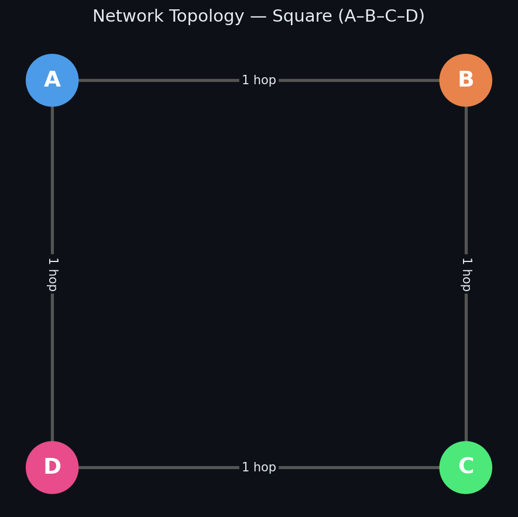
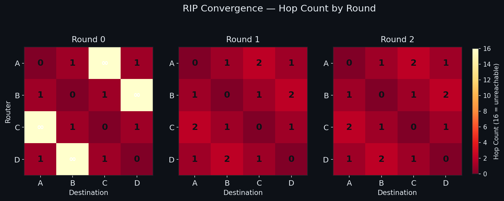
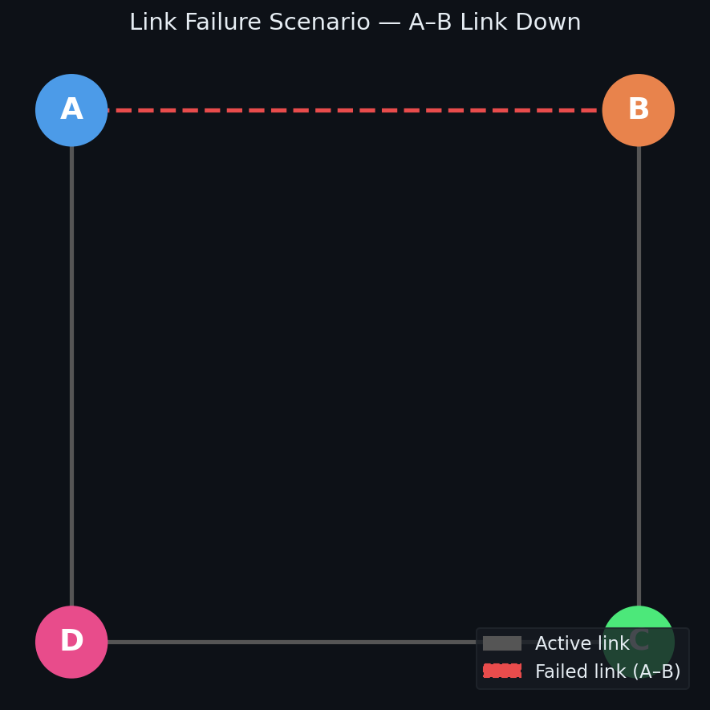
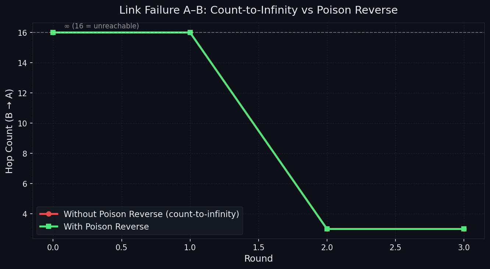

# RIP-Protocol-Simulation-
Python simulation of the RIP routing protocol using Bellman-Ford — includes normal convergence, count-to-infinity, and poison reverse on a square topology.

# RIP Protocol Simulation

A Python simulation of the **Routing Information Protocol (RIP)** using the Bellman–Ford algorithm on a square topology (A–B–C–D).

This project implements and visualises:
- Normal convergence from scratch
- Link failure behaviour **without** poison reverse (count-to-infinity)
- Link failure behaviour **with** poison reverse

> Originally developed as a networking assignment and extended here with a full Python implementation and visualisations.

---

## Network Topology

```
A ——— B
|     |
D ——— C
```

Each link costs 1 hop. Routers start knowing only themselves (0 hops) and direct neighbours (1 hop). All other destinations begin as unreachable (∞ = 16).



---

## How It Works

### Bellman–Ford Update Rule

Each round, every router receives its neighbours' routing tables and applies:

```
if (neighbour_cost + 1) < current_cost:
    update route
```

This is the core of RIP — routers iteratively discover shorter paths until no more updates occur (convergence).

### Scenario 1 — Normal Convergence

On a square topology, full convergence is achieved in **1 round**. After Round 1, all routers know the optimal (minimum-hop) path to every destination.



| Round | What happened |
|-------|--------------|
| 0 | Each router knows only itself and direct neighbours |
| 1 | 2-hop routes discovered (e.g. A learns A→B→C) |
| 2 | No changes — network fully converged |

### Scenario 2 — Link Failure (A–B removed)

After the A–B link goes down, the remaining topology is B–C–D–A (a chain).



**Without Poison Reverse** — Count-to-Infinity problem:
- B loses its direct route to A
- B hears from C and D that A is reachable (they learned it via routes that no longer exist)
- B's hop count for A increments each round: 2 → 3 → 4 → … → 16
- Slow convergence, routing loops possible

**With Poison Reverse:**
- When a router advertises a route back toward the neighbour it learned it from, it sends cost = ∞ instead
- This immediately breaks the loop
- Convergence is fast and clean



---

## Project Structure

```
rip-simulation/
├── rip_simulation.py   # Core simulation — Bellman-Ford, routing tables, scenarios
├── visualise.py        # Generates all plots (requires matplotlib, networkx)
├── images/
│   ├── topology.png
│   ├── topology_failure.png
│   ├── convergence_heatmap.png
│   └── count_to_infinity.png
└── README.md
```

---

## Running the Simulation

```bash
# Install dependencies
pip install matplotlib networkx numpy

# Run the simulation (prints routing tables to terminal)
python rip_simulation.py

# Generate all visualisation images
python visualise.py
```

---

## Key Findings

| Property | Value |
|----------|-------|
| Convergence rounds (normal) | 1 |
| Max hop count (RIP limit) | 15 (∞ = 16) |
| Count-to-infinity rounds (no poison reverse) | Until hop count reaches 16 |
| Count-to-infinity rounds (with poison reverse) | Resolved immediately |

### RIP Weaknesses highlighted

- **Max 15 hops** — severely limits network size
- **Slow convergence** after failures without poison reverse
- **Hop count only** — ignores bandwidth, delay, reliability
- **Count-to-infinity** — routing loops can persist for many rounds

---

## Concepts Covered

- Distance-vector routing (RIP)
- Bellman–Ford algorithm
- Routing table construction and exchange
- Network convergence
- Count-to-infinity problem
- Poison reverse as a loop-prevention technique
- Split horizon, hold-down timers (discussed in analysis)

---

## References

- Forouzan, B. A. — *Data Communications and Networking*
- RFC 2453 — RIP Version 2
